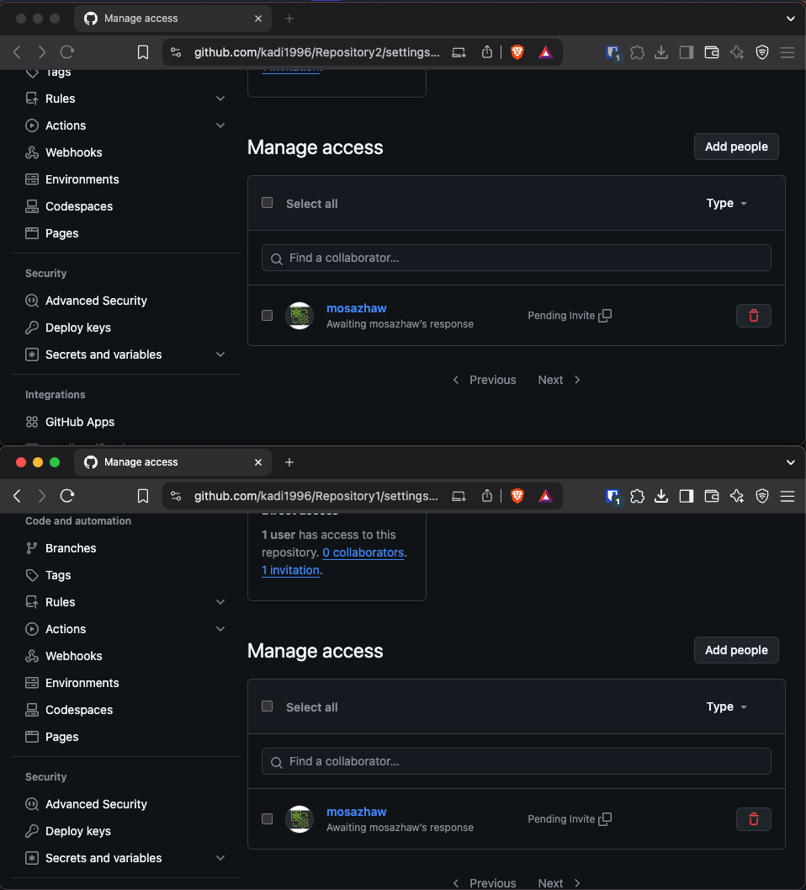
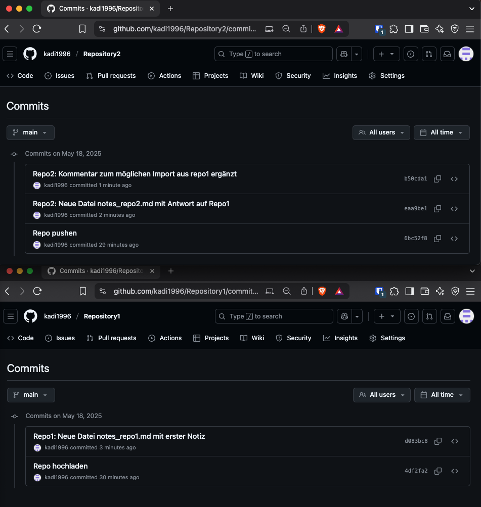
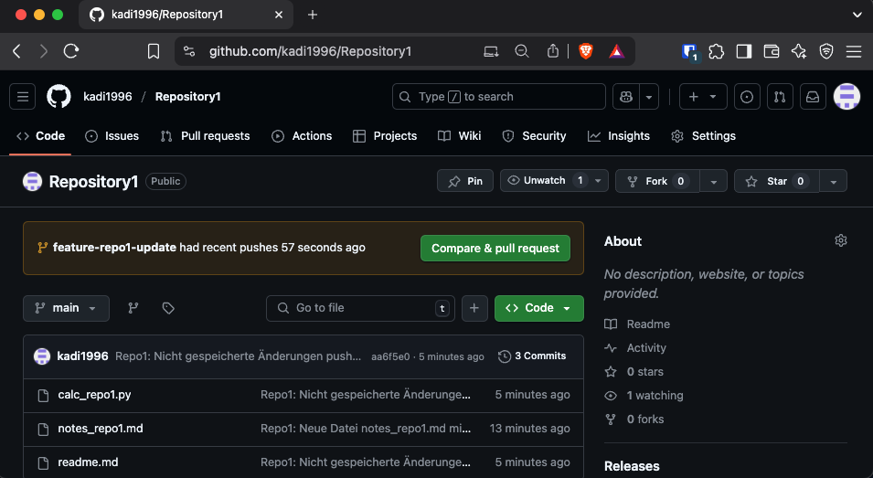
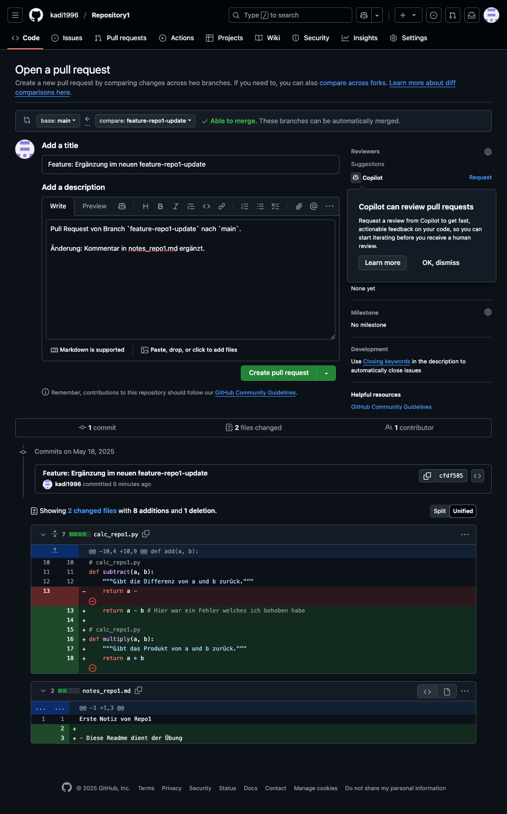
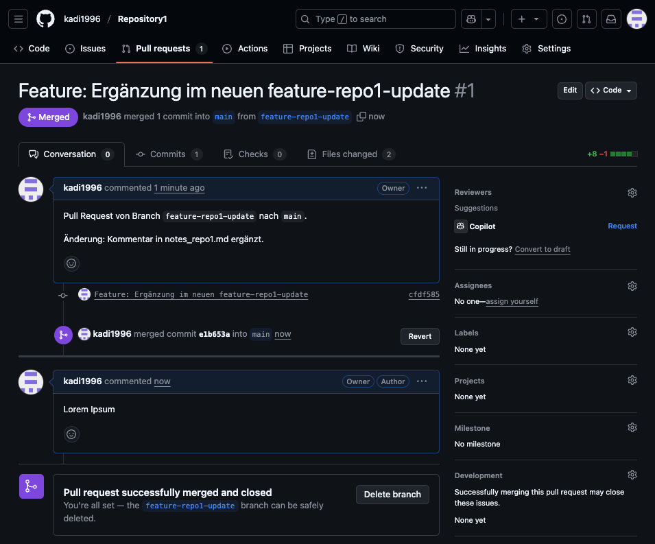

# DevOps 01 Version Control

| | Bitte ausfüllen |
| -------- | ------- |
| Repository1 | https://github.com/kadi1996/Repository1 |
| Repository2 | https://github.com/kadi1996/Repository2 |

## Part 1: Commits & Push

- Da ich keinen Partner / Partnerin gefunden habe, führe ich die Übung selbstständig durch und simuliere eine Zusammenarbeit 
- Dafür habe ich zwei verschiedene Repos erstellt, die ich oben verlinkt habe
- Ich habe jeweils eine Readme und eine Python-file hinzugefügt
- Da die Erwartung vorsieht, dass es einen Owner und Collaborator gibt füge ich `mosazhaw` als Collaborator hinzu 
- Repo -> Settings -> Collaborator -> Add Collaborator -> mosazhaw

- Als nächstes werde ich in jedem Repo die Readme + .py abwechselnd verändern und jede Änderung mit Kommentaren versehen

- In beiden Repos füge ich erstmal neue Datei hinzu, ändere Inhalte, committe und pushe sie auf Github

- Leider fällt mir auf, dass ich die Inhalte nicht gespeichert habe vor dem Commit 
- Dies hole ich jeweils mit einem `git add .` nach 

## Part 2: Branches & Pull Requests

- Anschliessend möchte Branches und Pull Requests erstellen
- Ich gehe in Repo1 und gebe im Terminal `git checkout -b feature-repo1-update` ein -> Damit erstelle ich einen neuen Branch namens `feature-repo1-update` und wechsel direkt auf diesen Branch
- Ich ändere ein paar Kleinigkeiten, committe und pushe diesen auf Github

- Anschliessend gehe ich auf mein Repo1 im Github und sehe folgendes: 

- Ich gehe auf `Compare & Pull Request`

- Ich schreibe etwas in die Beschreibung -> `Create Pull Request` -> `Merge Pull Request`

- Ich klicke auf `Confirm` -> `Comment`

- Der vollständige Workflow mit Branch und Pull Request wurde exemplarisch in einem Repository umgesetzt, um zu zeigen, dass das Prinzip verstanden und korrekt angewendet wurde. Auf den identischen, sich wiederholenden Ablauf im zweiten Repository wurde bewusst verzichtet.

- Damit erfülle ich alle Anforderungen für Woche 2 

